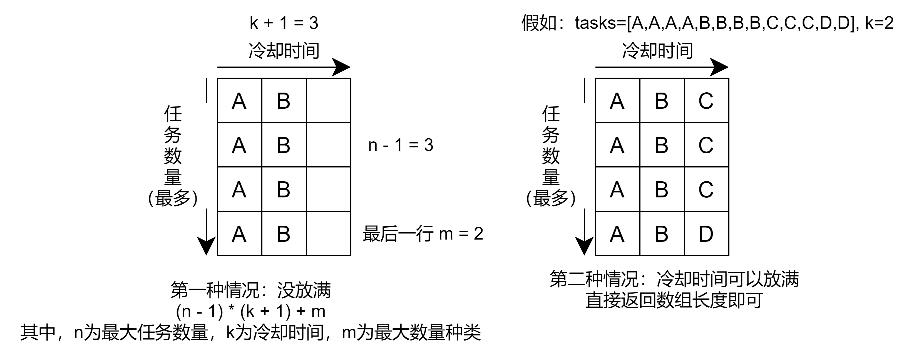

# 任务调度器-leetcode621

<a href="https://leetcode-cn.com/problems/task-scheduler/" target="_blank">任务调度器</a>

给你一个用字符数组 tasks 表示的 CPU 需要执行的任务列表。其中每个字母表示一种不同种类的任务。任务可以以任意顺序执行，并且每个任务都可以在 1 个单位时间内执行完。在任何一个单位时间，CPU 可以完成一个任务，或者处于待命状态。

然而，两个 相同种类 的任务之间必须有长度为整数 n 的冷却时间，因此至少有连续 n 个单位时间内 CPU 在执行不同的任务，或者在待命状态。

你需要计算完成所有任务所需要的 最短时间 。


**示例**

```js
输入：tasks = ["A","A","A","B","B","B"], n = 2
输出：8
解释：A -> B -> (待命) -> A -> B -> (待命) -> A -> B
在本示例中，两个相同类型任务之间必须间隔长度为 n = 2 的冷却时间，而执行一个任务只需要一个单位时间，所以中间出现了（待命）状态。 
```





```js
var leastInterval = function(tasks, n) {
  let AIndex = 'A'.charCodeAt(0);
  let arr = new Array(26).fill(0);
  function getIndex(char) {
    return char.charCodeAt(0) - AIndex;
  }
  // 找出单个任务执行最多的次数
  let maxRepeatTime = 0;
  for(let i=0; i<tasks.length; i++) {
    let index = getIndex(tasks[i]);
    arr[index] += 1;
    maxRepeatTime = Math.max(maxRepeatTime, arr[index]);
  }
  // 找出有几种任务执行了 maxRepeatTime 次
  let maxRepeatTime_taskNum = arr.filter(num => num === maxRepeatTime).length;
  
  return Math.max(tasks.length, (maxRepeatTime - 1) * (n + 1) + maxRepeatTime_taskNum)
}
```


