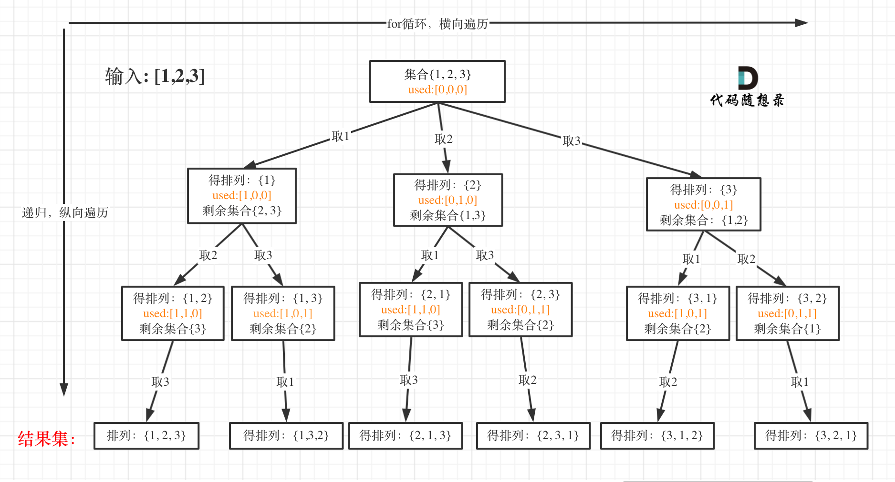

<a href="https://leetcode-cn.com/problems/permutations/" target="_blank">全排列</a>

给定一个不含重复数字的数组 `nums` ，返回其 **所有可能的全排列** 。你可以 **按任意顺序** 返回答案。

**示例1：**

```js
输入：nums = [1,2,3]
输出：[[1,2,3],[1,3,2],[2,1,3],[2,3,1],[3,1,2],[3,2,1]]
```

**示例2：**

```js
输入：nums = [0,1]
输出：[[0,1],[1,0]]
```

**示例3：**

```js
输入：nums = [1]
输出：[[1]]
```

**提示：**

- `1 <= nums.length <= 6`
- `-10 <= nums[i] <= 10`
- `nums` 中的所有整数互不相同


```js
var permute = function(nums) {
  const res = [], path = [];
  backtracking(nums, nums.length, [])
  return res;

  function backtracking(n, k, used) {
    if(path.length === k) {
      res.push(Array.from(path));
      return;
    }
    for(let i=0; i<k; i++) {
      if(used[i]) continue;
      path.push(n[i]);
      used[i] = true;
      backtracking(n, k, used);
      path.pop();
      used[i] = false;
    }
  }
};
```


**思路：**

以[1, 2, 3]为例，抽象树形结构如下：




**回溯三部曲：**

（1）递归函数参数

首先排列是有序的，也就是说【1,2】和【2,1】是两个集合。

排列问题需要一个 used 数组，标记已经选择的元素，如图中黄色部分所示


（2）递归终止条件

可以看出叶子节点，就是收割结果的地方。

那么什么时候算是到达叶子节点呢？

当收集元素的数组path的大小达到和nums数组一样大的时候，说明找到了一个全排列，也表示到达了叶子节点。


（3）单层搜索的逻辑

因为排列问题，每次都要从头开始搜索，例如元素1在【1,2】中已经使用过了，但是在【2,1】中还要再使用一次1

而used数组，其实就是记录此时path里都有哪些元素使用了，一个排列里一个元素只能使用一次。


