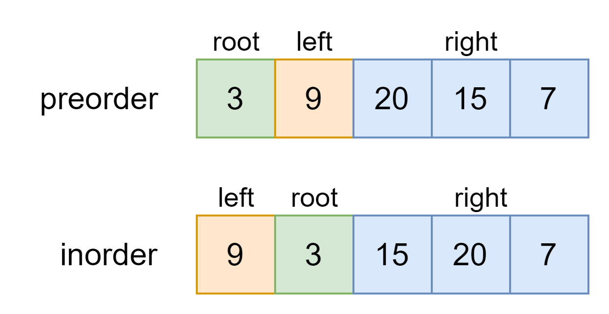

# 从前序与中序遍历序列构造二叉树-leetcode105

<a href="https://leetcode-cn.com/problems/construct-binary-tree-from-preorder-and-inorder-traversal/" target="_blank">从前序与中序遍历序列构造二叉树</a>

给定一棵树的前序遍历 `preorder` 与中序遍历 `inorder`。请构造二叉树并返回其根节点。

**示例**

```js
Input: preorder = [3,9,20,15,7], inorder = [9,3,15,20,7]
Output: [3,9,20,null,null,15,7]
```


**函数签名如下：**

```js
function buildTree(preorder, inorder)
```


我们首先要先办法确定根节点的值，把根节点做出来，然后递归构造左右子树即可。

回顾一下，前序遍历和中序遍历有什么特点

```js
function traverse(root) {
  // 前序遍历
  preorder.push(root.val);
  traverse(root.left);
  traverse(root.right);
}
function traverse(root) {
  traverse(root.left);
  // 中序遍历
  preorder.push(root.val);
  traverse(root.right);
}
```


找到**根节点**是很简单的，前序遍历的第一个值 `preorder[0]` 就是根节点的值，关键在于如何通过根节点的值，将 `preorder` 和 `postorder` 数组划分两半，构造根节点的左右子树



- 可以确定根节点（root）是 preorder[0]
- 找到 root 在 inorder 中的位置
- 在inorder中，root的左边就是左子树，右边就是右子树
- 递归 步骤 1~3


```js
var buildTree = function(preorder, inorder) {
  if(preorder.length === 0) return null;
  let pos = 0;
  // 确定root在inorder中的位置
  while(preorder[0] !== inorder[pos]) pos++;
  let l_pre = [], r_pre = [], l_in = [], r_in = [];
  // 组装左子树的所有节点
  for(let i=0; i<pos; i++) {
    l_pre.push(preorder[i+1]);
    l_in.push(inorder[i]);
  }
  // 组装右子树的所有节点
  for(let i=pos+1; i<preorder.length; i++) {
    r_pre.push(preorder[i]);
    r_in.push(inorder[i]);
  }
  let root = new TreeNode(preorder[0]);
  root.left = buildTree(l_pre, l_in);
  root.right = buildTree(r_pre, r_in);
  return root;
}
```


