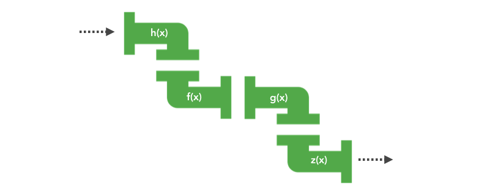

# 函数式编程

## 一、为什么叫函数式编程

​		其实函数我们从小就学，什么一次函数，二次函数……根据学术上函数的定义，函数即是一种描述集合和集合之间的**转换关系**，输入通过函数都会返回**有且只有一个**输出值。

​		所以，**函数**实际上是一个**关系**，或者说是一种映射，而这种映射关系是可以组合的，一旦我们知道一个函数的输出类型可以匹配另一个函数的输入，那他们就可以进行组合。

​		在我们的编程世界中，我们需要处理的其实也只有“数据”和“关系”，而关系就是函数。我们所谓的**编程工作**也不过就是在找一种**映射关系**，一旦关系找到了，问题就解决了，剩下的事情，就是让数据流过这种关系，然后转换成另一个数据罢了。

​		我特别喜欢用**流水线**去形容这种工作，把输入当做原料，把输出当做产品，**数据可以不断的从一个函数的输出可以流入另一个函数输入**，最后再输出结果，这不就是一套流水线嘛？



所以，函数式编程其实就是强调在编程过程中把更多的关注点放在如何去**构建关系**。通过构建一条高效的流水线，一次解决所有问题。而不是把精力分散在不同的加工厂中来回奔波传递数据。


## 二、函数式编程的特点

### 函数是“一等公民”（First-Class Function）

这是函数式编程得以实现的**前提**，因为我们基本的操作都是在操作函数。这个特性意味着函数与其他数据类型一样，处于平等地位，可以赋值给其他变量，也可以作为参数，传入另一个函数，或者作为别的函数的返回值。


### 声明式编程（declarative programming）

​		函数式编程大多时候都是在声明我需要做什么，而非怎么去做。这种编程风格称为`声明式编程`。这样有个好处是代码的可读性特别高，因为声明式代码大多都是接近自然语言的，同时，它解放了大量的人力，因为它不关心具体的实现，因此它可以把优化能力交给具体的实现，这也方便我们进行分工协作。

​		SQL 语句就是声明式的，你无需关心 Select 语句是如何实现的，不同的数据库会去实现它自己的方法并且优化。React 也是声明式的，你只要描述你的 UI，接下来状态变化后 UI 如何更新，是 React 在运行时帮你处理的，而不是靠你自己去渲染和优化 diff 算法。


### 惰性执行（lazy evaluation）

​		所谓惰性执行指的是函数只在需要的时候执行，即不产生无意义的中间变量。


### 无状态和数据不可变（statelessness and immutable data）

这是函数式编程的核心概念：

- **数据不可变：**它要求你所有的数据都是不可变的，这意味着如果你想修改一个对象，那你应该创建一个新的对象用来修改，而不是修改已有的对象。
- **无状态：**主要是强调对于一个函数，不管你何时运行，它都应该像第一次运行一样，给定相同的输入，给出相同的输出，完全不依赖外部状态的变化。

为了实现这个目标，函数式编程提出函数应该具备的特性：`没有副作用`和`纯函数`。


### 没有副作用（no side effects）

​		副作用这个词我们可算听的不少，它的含义是：在完成函数主要功能之外完成的其他副要功能。在我们函数中最主要的功能当然是根据输入**返回结果**，而在函数中我们最常见的副作用就是**随意操纵外部变量**。由于 JS 中对象传递的是引用地址，哪怕我们用 `const` 关键词声明对象，它依旧是可以变的。而正是这个“漏洞”让我们有机会随意修改对象。

例如： `map` 函数的本来功能是将输入的数组根据一个函数转换，生成一个新的数组：

```js
map : [a] -> [b]
```

而在 JS 中，我们经常可以看到下面这种对 `map` 的 “错误” 用法，把 `map` 当作一个循环语句，然后去直接修改数组中的值。

```js
const list = [...];
// 修改 list 中的 type 和 age
list.map(item => {
  item.type = 1;
  item.age++;
})
```

这样函数最主要的输出功能没有了，变成了直接修改了外部变量，这就是它的副作用。而没有副作用的写法应该是：

```js
const list = [...];
// 修改 list 中的 type 和 age
const newList = list.map(item => ({ ...item, type: 1, age: item.age + 1 }))
```

保证函数没有副作用，一来能保证数据的不可变性，二来能避免很多因为共享状态带来的问题。当你一个人维护代码时候可能还不明显，但随着项目的迭代，项目参与人数增加，大家对同一变量的依赖和引用越来越多，这种问题会越来越严重。最终可能连维护者自己都不清楚变量到底是在哪里被改变而产生 Bug。

> 传递引用一时爽，代码重构火葬场


其实纯函数的概念很简单，就是两点：

- **不依赖外部状态（无状态）：**函数的运行结果不依赖全局变量，this 指针，IO 操作等。
- **没有副作用（数据不变）：**不修改全局变量，不修改入参。

所以纯函数才是真正意义上的 “函数”，它意味着**相同的输入，永远会得到相同的输出**。

以下几个函数都是不纯的，因为他们都依赖**外部变量**，试想一下，如果有人调用了 `changeName` 对 `curUser` 进行了修改，然后你在另外的地方调用了 `saySth` ，这样就会产生你预料之外的结果。

```js
const curUser = {
  name: 'Dylan'
}
const saySth = str => curUser.name + ': ' + str; // 引用了全局变量
const changeName = (obj, name) => obj.name = name; // 修改了输入参数
changeName(curUser, 'Jack'); // { name: 'Jack' }
saySth('hello'); // Jack: hello
```

如果改成纯函数的写法会是怎么样呢？

```js
const curUser = {
  name: 'Dylan'
}
const saySth = (user, str) => user.name + ': ' + str; // 不依赖外部变量
const changeName = (user, name) => ({ ...user, name }); // 未修改外部变量
const newUser = changeName(curUser, 'Jack'); // { name: 'Jack' }
saySth(curUser, 'hello'); // Dylan: hello
```

这样就没有之前说的那些问题了。


我们这么强调使用纯函数，纯函数的意义是什么？

- **便于测试和优化：**这个意义在实际项目开发中意义非常大，由于纯函数对于相同的输入永远会返回相同的结果，因此我们可以轻松断言函数的执行结果，同时也可以保证函数的优化不会影响其他代码的执行。这十分符合**测试驱动开发 TDD（Test-Driven Development )** 的思想，这样产生的代码往往健壮性更强。
- **可缓存性：**因为相同的输入总是可以返回相同的输出，因此，我们可以提前缓存函数的执行结果，有很多库有所谓的 `memoize` 函数，下面以一个简化版的 `memoize` 为例，这个函数就能缓存函数的结果，对于像 `fibonacci` 这种计算，就可以起到很好的缓存效果。

```js
function memoize(fn) {
  const cache = {};
  return function() {
    const key = JSON.stringify(arguments);
    let value = cache[key];
    if(!value) {
      value = [fn.apply(null, arguments)]; // 放在一个数组中，方便应对 undefined，null 等异常情况
      cache[key] = value;
      console.log(key);
    }
    return value[0];
  }
}

const fibonacci = memoize(n => n < 2 ? n : fibonacci(n - 1) + fibonacci(n - 2));
console.log(fibonacci(4)); // 执行后缓存了fibonacci(2), fibonacci(3),  fibonacci(4)
console.log(fibonacci(10)) // fibonacci(2), fibonacci(3),  fibonacci(4) 的结果直接从缓存中取出，同时缓存其他的
```

- **自文档化：**由于纯函数没有副作用，所以其依赖很明确，因此更易于观察和理解（配合类型签名）
- **更少的Bug：**使用纯函数意味着你的函数**不存在指向不明的 this，不存在对全局变量的引用，不存在对参数的修改**，这些共享状态往往是绝大多数bug的源头。


## 三、流水线的构建

如果说函数式编程中有两种操作是必不可少的那无疑就是**柯里化（Currying）**和**函数组合（Compose）**，柯里化其实就是流水线上的**加工站**，函数组合就是我们的**流水线**，它由多个加工站组成。


### 加工站---柯里化

柯里化是将一个多元函数，转换成一个依次调用的单元函数。

```js
f(a,b,c) -> f(a)(b)(c)
```

我们尝试写一个 `curry` 版本的 `add` 函数

```js
var add = function(x) {
  return function(y) {
    return x + y;
  }
}
const increment = add(1);
increment(10); // 11
```

为什么这个单元函数很重要？还记得我们之前说过的，函数的返回值，**有且只有一个嘛？** 如果我们想顺利的组装流水线，那我就必须保证我每个加工站的输出刚好能流向下个工作站的输入。**因此，在流水线上的加工站必须都是单元函数。**

现在很好理解为什么柯里化配合函数组合有奇效了，因为柯里化处理的结果刚好就是**单输入**的。


### 部分函数应用 vs 柯里化

经常有人搞不清柯里化和**部分函数应用** ( Partial Function Application )，经常把他们混为一谈，其实这是不对的，在维基百科里有明确的定义，部分函数应用强调的是固定一定的参数，返回一个**更小元的函数**。通过以下表达式展示出来就明显了：

```js
// 柯里化
f(a, b, c) -> f(a)(b)(c)
// 部分函数调用
f(a, b, c) -> f(a)(b, c) / f(a, b)(c)
```

**柯里化**强调的是**生成单元函数**，**部分函数应用**的强调的**固定任意元参数**，而我们平时生活中常用的其实是**部分函数应用**，这样的好处是可以固定参数，降低函数通用性，提高函数的适合用性。

```js
// 假设一个通用的请求API
const request = (type, url, options) => ...
// GET 请求
request('GET', 'http://....')
// POST 请求
request('POST', 'http://....')
// 但是通过部分调用后，我们可以抽出特定 type 的 request
const get = request('GET');
get('http://', {..})
```


### 高级柯里化

通常我们不会自己去写 `curry` 函数，现成的库大多都提供了 `curry` 函数的实现，但是使用过的人肯定有会有疑问，我们使用的 Lodash，Ramda 这些库中实现的 `curry` 函数的行为好像和柯里化不太一样呢，他们实现的好像是部分函数应用呢？

```js
const add = R.curry((x, y, z) => x + y + z);
const add7 = add(7);
add7(1, 2); // 10
const add1_2 = add(1, 2);
add1_2(7); // 10
```

其实，这些库中的 `curry` 函数都做了很多优化，导致这些库中实现的柯里化其实不是纯粹的柯里化，我们可以把他们理解为“高级柯里化”。这些版本实现可以根据你输入的参数个数，**返回一个柯里化函数/结果值**。即，**如果你给的参数个数满足了函数条件，则返回值**。这样可以解决一个问题，就是如果一个函数是多输入，就可以避免使用 `(a)(b)(c)` 这种形式传参了。

所以上面的 `add7(1, 2)` 能直接输出结果不是因为 `add(7)` 返回了一个接受 2 个参数的函数，而是你刚好传了 2 个参数，满足了所有参数，因此给你计算了结果，下面的代码就很明显了：

```js
const add = R.curry((x, y, z) =>  x + y + z);
const add7 = add(7);
add7(1) // function
```

如果 `add7` 是一个接受 2 个参数的函数，那么 `add7(1)` 就不应该返回一个 function 而是一个值了。

因此，记住这句话：**我们可以用高级柯里化去实现部分函数应用，但是柯里化不等于部分函数应用**。


### 柯里化的应用

通常，我们在实践中使用柯里化都是为了把某个函数变得单值化，这样可以增加函数的多样性，使得其适用性更强：

```js
const replace = curry((a, b, str) => str.replace(a, b))
const replaceSpaceWith = replace(/\s*/);
const replaceSpaceWithComma = replaceSpaceWith(',');
const replaceSpaceWithDash = replaceSpaceWith('-');
```

通过上面这种方式，我们从一个 `replace` 函数中产生很多新函数，可以在各种场合进行使用。

更重要的是，**单值函数**是我们即将讲到的**函数组合的基础**。


### 流水线---函数组合

上面我们借助 `curry`，已经可以很轻松的构造一个加工站了，现在就是我们组合成流水线的时候了。


#### 函数组合概念

函数组合的目的是将多个函数组合成一个函数。下面来看一个简化版的实现：

```js
const compose = (f, g) => x => f(g(x));

const f = x => x + 1;
const g = x => x * 2;
const fg = compose(f, g);
fg(1); // 3
```

我们可以看到 `compose` 就实现了一个简单的功能：形成了一个全新的函数，而这个函数就是一条从 `g -> f` 的流水线。同时我们可以很轻易的发现 `compose`其实是满足结合律的。

```js
compose(f, compose(g, t)) = compose(compose(f, g), t) = f(g(t(x)))
```

只要其顺序一致，最后的结果是一致的，因此，我们可以写个更高级的 `compose`，支持多个函数组合：

```js
compose(f, g, t) => x => f(g(t(x)))
```

简单实现如下：

```js
const compose = (...fns) => 
  (...args) => 
    fns.reduceRight((val, fn) => fn.apply(null, [].concat(val)), args);

const f = x => x + 1;
const g = x => x * 2;
const t = (x, y) => x + y;

let fgt = compose(f, g, t);
fgt(1, 2); // 3 -> 6 -> 7
```

> 解释compose函数：compose函数接收一个函数数组，返回一个函数。返回的这个函数被执行时，从右向左开始执行，args是其初始入参，上一个函数的返回值是下一个函数入参。


#### 函数组合应用

考虑一个小功能：将数组最后一个元素大写，假设 `log`, `head`，`reverse`，`toUpperCase` 函数存在（我们通过 `curry` 可以很容易写出来）

命令式的写法：

```js
log(toUpperCase(head(reverse(arr))))
```

面向对象的写法：

```js
arr.reverse()
  .head()
  .toUpperCase()
  .log()
```

链式调用看起来顺眼多了，然而问题在于，原型链上可供我们链式调用的函数是有限的，而需求是无限的 ，这限制了我们的逻辑表现力。

再看看，现在通过组合，我们如何实现之前的功能：

```js
const upperLastItem = compose(log, toUpperCase, head, reverse);
```

通过参数我们可以很清晰的看出发生了 uppderLastItem 做了什么，它完成了一套流水线，所有经过这条流水线的参数都会经历：`reverse` -> `head` -> `toUpperCase` -> `log` 这些函数的加工，最后生成结果。


最完美的是，这些函数都是非常简单的纯函数，你可以随意组合，随意拿去用，不用有任何的顾忌。

其实有些经验丰富的程序猿已经看出来一些蹊跷，这不就是所谓管道 ( `pipe` ) 的概念嘛？在 Linux 命令中常会用到，类似`ps` `grep`的组合

```js
ps -ef | grep nginx
```

只是管道的执行方向和 compose (从右往左的组合 ) 好像刚好相反，因此很多函数库（Lodash，Ramda）中也提供了另一种组合方式：`pipe`（从左往右的组合）

```js
const upperLastItem = R.pipe(reverse, head, toUppderCase, log);
```

其实函数式编程的理念和 Linux 的设计哲学很像：

> 有众多单一目的的小程序，一个程序只实现一个功能，多个程序组合完成复杂任务。


#### 函数组合的好处

函数组合的好处显而易见，它让代码变得简单而富有可读性，同时通过不同的组合方式，我们可以轻易组合出其他常用函数，让我们的代码更具表现力

```js
// 组合方式 1
const last = compose(head, reverse);
const shout = compose(log, toUppercase);
const shoutLast = compose(shout, last);
// 组合方式 2
const lastUpper = compose(toUpperCase, head, reverse);
const logLastUpper = compose(log, lastUpper);
```

这个过程，就像搭乐高积木一样。


由此可见，大型的程序，都可以通过这样一步步的拆分组合实现，而剩下要做的，就是去构造足够多的积木块（函数）。


## 四、实践经验

在使用柯里化和函数组合的时候，有一些经验可以借鉴一下：

### 柯里化中要把操作的数据放到最后

因为我们的输出通常是需要操作的数据，这样当我们固定了之前的参数（我们可以称为**配置**）后，可以变成一个单元函数，直接被**函数组合**使用，这也是其他的函数式语言遵循的规范：

```js
const split = curry((x, str) => str.split(x));
const join = curry((x, arr) => arr.join(x));
const replaceSpaceWithComma = compose(join(','), split(' '));
const replaceCommaWithDash = compose(join('-'), split(','));
```

但是如果有些函数没遵循这个约定，我们的函数该如何组合？当然也不是没办法，很多库都提供了占位符的概念，例如 Ramda 提供了一个占位符号（`R.__`）。假设我们的 `split` 把 `str` 放在首位

```js
const split = curry((str, x) => str.split(x));
const replaceSpaceWithComma = compose(join(','), split(R.__, ' '));
```


### 函数组合中函数要求单输入

函数组合有个使用要点，就是中间的函数一定是**单输入**的，这个很好理解，之前也说过了，因为函数的输出都是单个的（数组也只是一个元素）。


### 函数组合的Debug

当遇到函数出错的时候怎么办？我们想知道在哪个环节出错了，这时候，我们可以借助一个辅助函数 `trace`，它会临时输出当前阶段的结果。

```js
const trace = curry((tip, x) => { console.log(tip, x); return x; });
const lastUpper = compose(toUpperCase, head, trace("after reverse"), reverse);
```


### 所参考Ramda

现有的函数式编程工具库很多，Lodash/fp 也提供了，但是不是很推荐使用 Lodash/fp 的函数库，因为它的很多函数把需要处理的参数放在了首位（ 例如 `map` ）这不符合我们之前说的最佳实践。

这里推荐使用 [Ramda](https://ramda.cn/docs/)，它应该是目前最符合函数式编程的工具库，它里面的所有函数都是 `curry` 的，而且需要操作的参数都是放在最后的。上述的 `split`，`join`，`replace` 这些基本的都在 Ramda 中可以直接使用，它一共提供了 200 多个超实用的函数，合理使用可以大大提高你的编程效率（目前我的个人经验来说，我需要的功能它 90%都提供了）。


## 五、实战一下

假设我现在有一套数据：

```js
const data = [
  {
    name: 'Peter',
    sex: 'M',
    age: 18,
    grade: 99
  },
  ……
]
```

实现以下几个常用功能：

1. 获取所有年龄小于 18 岁的对象，并返回他们的名称和年龄。
2. 查找所有男性用户。
3. 更新一个指定名称用户的成绩（不影响原数组）。
4. 取出成绩最高的 10 名，并返回他们的名称和分数。


这边提供以下 Ramda 库中的参考函数：

```js
// 对象操作（最后一个参数是对象），均会返回新的对象拷贝
R.prop('name')    // 获取对象 name 字段的值
R.propEq('name', '123')   // 判断对象 name 字段是否等于‘123’
R.assoc('name', '123')   // 更新对象的'name'的值为'123'
R.pick(['a', 'd']); //=> {a: 1, d: 4}  // 获取对象某些属性，如果对应属性不存在则不返回
R.pickAll(['a', 'd']); //=> {a: 1, d: 4}  // 获取对象某些属性，如果对应属性不存在则返回`key : undefined`

// 数组操作
R.map(func)  // 传统的 map 操作
R.filter(func)  // 传统的 filter 操作
R.reject(func)  // filter 的补集
R.take(n)    // 取出数组前 n 个元素

// 比较操作
R.equals(a, b)  // 判断 b 是否等于 a 
R.gt(2, 1) => true  // 判断第一个参数是否大于第二个参数
R.lt(2, 1) => false // 判断第一个参数是否小于第二个参数

// 排序操作
R.sort(func)    // 根据某个排序函数排序
R.ascend(func)    // 根据 func 转换后的值，生成一个升序比较函数
R.descend(func)    // 根据 func 转换后的值，生成一个降序比较函数
// 实例
R.sort(R.ascend(R.prop('age'))) // 根据 age 进行升序排序 

// 必备函数
R.pipe()   //compose 的反向，从前往后组合
R.compose()  // 从后到前组合
R.curry()  // 柯里化
```


## 六、总结

函数式编程的优点：

- **代码简介，开发快速：**函数式编程大量使用函数的组合，函数的复用率很高，减少了代码的重复，因此程序比较短，开发速度较快。
- **接近自然语言，易于理解：**函数式编程大量使用声明式代码，基本都是接近自然语言的，加上它没有乱七八糟的循环，判断的嵌套，因此特别易于理解。
- **易于“并发编程”：**函数式编程没有副作用，所以函数式编程不需要考虑 “死锁”（Deadlock），所以根本不存在 “锁” 线程的问题。
- **更少的出错概率：**因为每个函数都很小，而且相同输入永远可以得到相同的输出，因此测试很简单，同时函数式编程强调使用纯函数，没有副作用，因此也很少出现奇怪的Bug。

因此，如果用一句话来形容函数式编程，应该是：`Less code, fewer bugs` 。因为写的代码越少，出错的概率就越小。人是最不可靠的，我们应该尽量把工作交给计算机。

一眼看下来好像函数式可以解决所有的问题，但是实际上，函数式编程也不是什么万能的灵丹妙药。正因为函数式编程有以上特点，所以它天生就有以下缺陷：

- **性能：**函数式编程相对于指令式编程，性能绝对是一个短板，因为它往往会对一个方法进行过度包装，从而产生上下文切换的性能开销。同时，在 JS 这种非函数式语言中，函数式的方式必然会比直接写语句指令慢（引擎会针对很多指令做特别优化）。就拿原生方法 `map` 来说，它就要比纯循环语句实现迭代慢 8 倍。
- **资源占用：**在 JS 中为了实现对象状态的不可变，往往会创建新的对象，因此，它对垃圾回收（Garbage Collection）所产生的压力远远超过其他编程方式。这在某些场合会产生十分严重的问题。
- **递归陷阱：**在函数式编程中，为了实现迭代，通常会采用递归操作，为了减少递归的性能开销，我们往往会把递归写成尾递归形式，以便让**解析器**进行优化。但是众所周知，JS 是不支持尾递归优化的（虽然 ES6 中将尾递归优化作为了一个规范，但是真正实现的少之又少）

因此，在性能要求很严格的场合，函数式编程其实并不是太合适的选择。

但是换种思路想，软件工程界从来就没有停止过所谓的银弹之争，却也从来没诞生过什么真正的银弹，各种编程语言层出不穷，各种框架日新月异，各种编程范式推陈出新，结果谁也没有真正的替代谁。

学习函数式编程真正的意义在于：让你意识到在指令式编程，面向对象编程之外，还有一种全新的编程思路，一种用函数的角度去**抽象**问题的思路。学习函数式编程能大大丰富你的武器库，不然，**当你手中只有一个锤子，你看什么都像钉子**。


