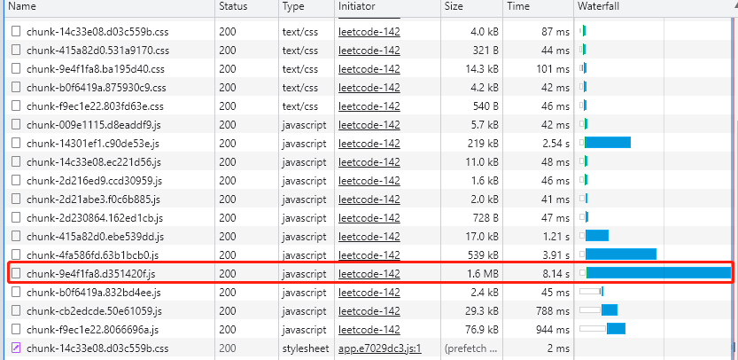
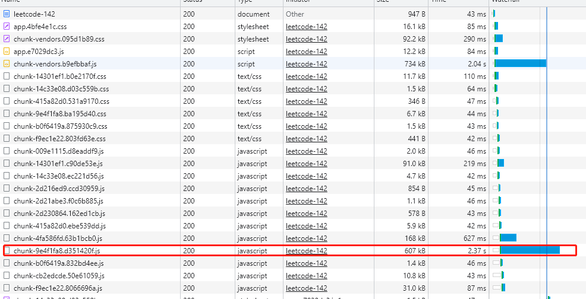

# 开启Gzip加速

> gzip是GNU zip的缩写，顾名思义是一种压缩技术。它将浏览器请求的文件先在服务器端进行压缩，然后传递给浏览器，浏览器解压之后再进行页面的解析工作。在服务端开启Gzip支持后，我们前端需要提供资源压缩包，通过Compression-Webpack-Plugin插件build提供压缩。


### 1、安装插件

```bash
cnpm i compression-webpack-plugin@6 -D
```


### 2、vue.config.js配置

```js
const CompressionWebpackPlugin = require('compression-webpack-plugin');
const isProduction = process.env.VUE_APP_ENV === 'production'; 

configureWebpack: (config) => {
  const plugins = [];
  if (isProduction) {
    plugins.push(
      new CompressionWebpackPlugin({
        filename: "[path].gz[query]",
        algorithm: "gzip",
        test: /\.(js|css|json|txt|html|ico|svg)(\?.*)?$/i,
        threshold: 10240,
        minRatio: 0.8
      })
    )
  }
  config.plugins = [...config.plugins, ...plugins];
},
```


### 3、nginx配置

```json
server {
  listen  80;
  gzip on;
  gzip_proxied any;
  gzip_types #接受哪些类型文件
    text/css
    text/javascript
    text/xml
    text/plain
    image/x-icon
    application/javascript
    application/x-javascript
    application/json; 
  location / {
    root    /usr/share/nginx/comp;
    index   index.html index.htm;
    try_files $uri $uri/ /index.html;
  }
}
```


**有图有真相**

配置前：



配置后：




