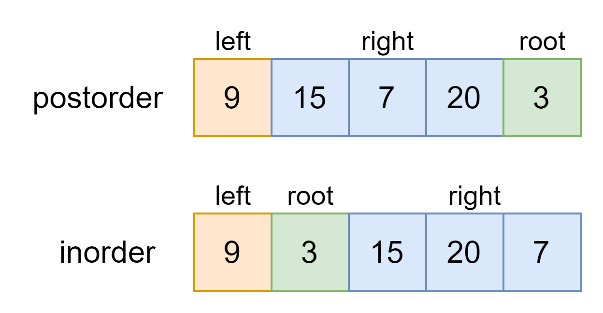

# 6.从中序与后序遍历序列构造二叉树-leetcode106

<a href="https://leetcode-cn.com/problems/construct-binary-tree-from-inorder-and-postorder-traversal/" target="_blank">从中序与后序遍历序列构造二叉树</a>

根据一棵树的中序遍历与后序遍历构造二叉树。

**示例：**

```js
中序遍历 inorder = [9,3,15,20,7]
后序遍历 postorder = [9,15,7,20,3]
输出：
    3
   / \
  9  20
    /  \
   15   7
```


先来看看中序和后序遍历的特点

```js
function traverse(root) {
  traverse(root.left);
  traverse(root.right);
  // 后序遍历
  postorder.push(root.val);
}
function traverse(root) {
  traverse(root.left);
  // 中序遍历
  inorder.push(root.val);
  traverse(root.right);
}
```




这道题和上一题的关键区别是，后序遍历和前序遍历相反，根节点对应的值为 `postorder` 的最后一个元素。

```js
var buildTree = function(inorder, postorder) {
    if(inorder.length === 0) return null;
    let pos = 0;
    while(postorder[postorder.length - 1] !== inorder[pos]) pos++;
    let l_in = [], r_in = [], l_post = [], r_post = [];
    for(let i=0; i<pos; i++) {
        l_in.push(inorder[i]);
        l_post.push(postorder[i]);
    }
    for(let i=pos+1; i<inorder.length; i++) {
        r_in.push(inorder[i]);
        r_post.push(postorder[i-1]);
    }
    let root = new TreeNode(postorder[postorder.length - 1]);
    root.left = buildTree(l_in, l_post);
    root.right = buildTree(r_in, r_post);
    return root;
};
```


