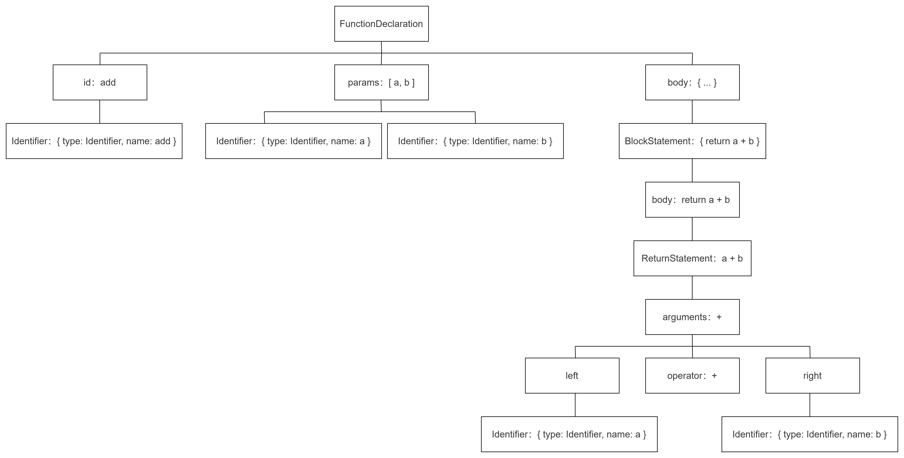

		AST在日常业务中也许很难涉及到，但当你不止于想做一个工程师，而想做工程师的工程师，写出vue、react之类的大型框架，或类似webpack、vue-cli前端自动化的工具，或者有批量修改源码的工程需求，那你必须懂得AST。AST的能力十分强大，且能帮你真正吃透javascript的语言精髓。

​		事实上，在javascript世界中，你可以认为抽象语法树(AST)是最底层。 再往下，就是关于转换和编译的“黑魔法”领域了。


## 一、拆解一个简单的add函数

```js
function add(a, b) {
    return a + b
}
```

首先，我们拿到的这个语法块，是一个FunctionDeclaration(函数定义)对象。

拆开后，它成了三块：

- 一个id，就是它的名字，即add
- 两个params，就是它的参数，即[a, b]
- 一块body，也就是大括号内的一堆东西


### add

add没办法继续拆下去了，它是一个最基础 Identifier（标志）对象，用来作为函数的唯一标志，就像人的姓名一样。

```js
{
    name: 'add'
    type: 'identifier'
    ...
}
```


### params

params继续拆下去，其实是两个Identifier组成的数组。之后也没办法拆下去了。

```js
[
    {
        name: 'a'
        type: 'identifier'
        ...
    },
    {
        name: 'b'
        type: 'identifier'
        ...
    }
]
```


### body

接下来，我们继续拆开body

我们发现，body其实是一个BlockStatement（块状域）对象，用来表示是 `{return a + b}`

打开Blockstatement，里面藏着一个ReturnStatement（Return域）对象，用来表示 `return a + b`

继续打开ReturnStatement,里面是一个BinaryExpression(二项式)对象，用来表示 `a + b`

继续打开BinaryExpression，它成了三部分，`left`，`operator`，`right`

- `operator` 即 `+`
- `left` 里面装的，是 Identifier 对象 `a`
- `right` 里面装的，是 Identifer 对象 `b`

就这样，我们把一个简单的add函数拆解完毕，用图表示就是：



看！抽象语法树(Abstract Syntax Tree)，的确是一种标准的树结构。


